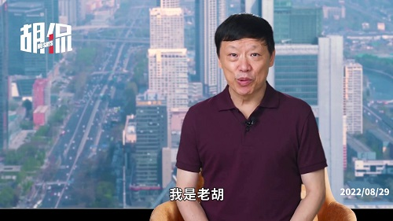
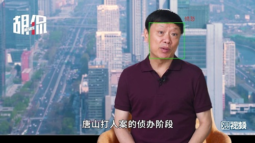

# GoldminerER
## 一、基于面部表情的情绪识别<PVER-master>
### 环境配置
1. 系统环境配置。于PVER-master/config路径下进行如下操作
  - 新建conda环境, python版本为3.7
  - 使用pip命令分别安装torch2.x、tensorflow1.x、keras2.x、moviepy、cv2、transformers进行基础环境配置，可直接在PVER-master路径下打开命令行执行如下代码
  ```python
  # 由于conda以及pypi官方镜像现在不对python3.6以后的版本提供Dlib安装源，因此需要分两次安装环境
  pip install -r requirements.txt
  ```
  - 安装该路径下的visual sutdio社区版, 勾选python开发以及C++桌面开发（这一步是为了提供Dlib安装基础）
  - 安装该路径下的CMake
  - 使用pip在虚拟环境下安装CMake以及Boost
  ```python
  pip install CMake
  pip install Boost
  ```
  - 安装该路径下的dlib-19.22.99-cp37-cp37m-win_amd64.whl
  ```python
  # 一定要在PVER-master/config路径下打开命令行，否则使用绝对路径进行安装
  pip install dlib-19.22.99-cp37-cp37m-win_amd64.whl
  ```
  - 安装人脸识别模块
  ```python
  pip install face_recognition
  ```
  - 安装音频识别模块
  ```python
  pip install librosa
  ```
### 开始使用
1. 打开PVER-master路径下的main.py, 这是项目的入口.
2. 将以mp4结尾的音视频文件存放在./Repo/video/mp4文件夹下
3. 在main函数中进行如下设定，并在video2data函数中根据注释设置对应的参数，开始进行音视频分离以及视频帧抽取任务
```python
video_tag = True
```
4. 在main函数中进行如下设定, 开始对被抽取的视频帧及音频进行情绪识别任务
```python
video_tag = False
```
### 过程展示
1. 将视频存入指定路径并执行程序
2. 程序将视频的音视频进行分离并对视频进行抽帧，抽帧结果如下</br>

3. 程序输入音视频多模态情绪识别模型，并逐帧框出人脸范围，并对面部情绪进行识别</br>

### 项目结构说明
待补充

# 二、基于音频的情绪识别

## 环境配置

1. 基本环境配置与上一节中基于面部表情的情绪识别一致

# 三、文本主题识别

待补充
# 四、COGMEN
### Requirements
We use PyG (PyTorch Geometric) for the GNN component in our architecture. RGCNConv and TransformerConv

使用 comet 记录所有实验，并使用其贝叶斯优化器调整超参数。

对于文本特征，我们使用 SBERT。
### 环境配置
python3.7版本及以上

Pytorch如果安装GPU版本，cuda版本需要11.7及以上

pip install comet_ml --upgrade #使用默认的 Python，comet_ml升级到最新版本

pip install torch_geometric（如果报错可卸载最新版本，使用2.1.0版本）

pip install -U sentence-transformers
### 数据预处理
数据集：iemocap_4

对数据集进行处理，运行

python preprocess.py --dataset="iemocap_4"
### 开始训练
python train.py --dataset="iemocap_4" --modalities="atv" --from_begin --epochs=55
### 运行评估
python eval.py --dataset="iemocap_4" --modalities="atv"

### 引用
Paper: https://arxiv.org/abs/2205.02455

https://github.com/Exploration-Lab/COGMEN

# chinese_keyphrase_extractor (CKPE)

## 五.关键词网络关系抽取

### 1.使用方法 Usage

#### 安装 Installation
- 仅支持 python3  
- 自动安装 pkuseg 依赖包   
- python3 only supported  
- Automatic installation of pkuseg dependency package  


- [JioNLP](https://github.com/dongrixinyu/JioNLP) 同样支持短语抽取，工具包安装方法：
```
$ pip install jionlp
```


#### 示例代码 Sample code 

- 输入必须为 **utf-8** 编码字符串  
- 具体函数参数见代码  
- Input must be **utf-8** encoding string  
- Check code for specific function parameters  

### 2.抽取关键短语
```
import ckpe    

ckpe_obj = ckpe.ckpe()
# 初次导入时会自动下载北大词性标注模型包，自动加载入内存（50M）  
# 若由于网速原因下载失败，请参考 https://github.com/lancopku/pkuseg-python 如何安装下载 pkuseg 默认模型  
# Speech Tagging Model Package of pkyseg will be downloaded automatically upon initial import  
# If downloading fails due to network speed, please refer to how to install and download pkuseg default model in https://github.com/lancopku/pkuseg-python  

text = '法国媒体最新披露，巴黎圣母院火灾当晚，第一次消防警报响起时，负责查验的保安找错了位置，因而可能贻误了救火的最佳时机。...'
key_phrases = ckpe_obj.extract_keyphrase(text)
print(key_phrases)
print(ckpe_obj.extract_keyphrase.__doc__)
```

- **JioNLP 工具包调用方法**：
```
>>> import jionlp as jio
>>> text = '朝鲜确认金正恩出访俄罗斯 将与普京举行会谈...'
>>> key_phrases = jio.keyphrase.extract_keyphrase(text)
>>> print(key_phrases)
>>> print(jio.keyphrase.extract_keyphrase.__doc__)

# ['俄罗斯克里姆林宫', '邀请金正恩访俄', '举行会谈',
#  '朝方转交普京', '最高司令官金正恩']
```


### 3.扩展类型短语
```
text = '聚氯乙烯树脂、塑料制品、切割工具、人造革、人造金刚石、农药（不含危险化学品）、针纺织品自产自销。...'
word_dict = {'聚氯乙烯': 1, '塑料': 1, '切割': 1, '金刚石': 1}  # 词汇: 词频（词频若未知可全设 1）
key_phrases = ckpe_obj.extract_keyphrase(text, top_k=-1, specified_words=word_dict)
print(key_phrases)
```

### 4.NER任务的短语扩充
```
text = '国务院下发通知，山西省法院、陕西省检察院、四川省法院、成都市教育局。...'
word_dict = {'局': 1, '国务院': 1, '检察院': 1, '法院': 1}
key_phrases = ckpe_obj.extract_keyphrase(text, top_k=-1, specified_words=word_dict, 
                                         remove_phrases_list=['麻将局'])
print(key_phrases)
```


#### 计算主题向量

- 工具包中默认的主题模型参数由100万篇各个类型的新闻文本，以及少部分社交媒体文本训练得到。
- 若需要针对特定领域文本处理，则需要根据特定的语料重新训练模型，并按相应的文件格式做替换。
- 主题模型采用标准的 LDA 模型训练得到，工具包可选择 gensim、sklearn、familia 等，训练完毕后可以得到主题词的分布表示，进而可以得到每个词汇在不同主题下的分布。由此可以得出词汇的主题突出度。

#### 原理 Principle of algorithm

- 首先基于 pkuseg 工具做分词和词性标注，再使用 tfidf 计算文本的关键词权重，  
- 关键词提取算法找出碎片化的关键词，然后再根据相邻关键碎片词进行融合，重新计算权重，去除相似词汇。得到的融合的多个关键碎片即为关键短语。  
    - 短语的 token 长度不超过 12  
    - 短语中不可出现超过1个虚词  
    - 短语的两端 token 不可是虚词和停用词  
    - 短语中停用词数量不可以超过规定个数  
    - 短语重复度计算 MMR 添加其中  
    - 提供仅抽取名词短语功能  
- 使用预训练好的 LDA 模型，计算文本的主题概率分布，以及每一个候选短语的主题概率分布，得到最终权重  
- Firstly do word segmentation and part of speech tagging based on pkuseg tool, then use word level tfidf to calculate the keyword weight of the text.  
- Fuse the adjacent key fragment words, recalculates the weights, and removes the similar words. The fused key fragments are candidate keyphrases. Rules include:  
    - Token length of phrase can not exceed 20  
    - There cannot be more than one function word in a phrase  
    - The token at both ends of the phrase should not be the function word and stop words  
    - The number of stopwords in a phrase cannot exceed the specified number  
    - Phrase repetition calculation is added  
    - Provide only noun phrases extraction parameters  
- Calculating the topic probability distribution of the text and the topic probability distribution of each candidate phrase by using the pre-trained LDA model to obtain the final weight  


## 五：知识图谱构建
### 1.依赖安装
python>=3.7

```python
pip install -r requirements.txt
```
### 2. 算法功能和使用方法
该算法实现从非结构化文本中抽取实体和关系，并将其组成三元组，构建知识图谱。<br>
**执行算法**
```
python3 demo_test.py --sens "2022年6月10日2时40分许，陈继志到正在店内用餐的被害人王某某、李某、远某、刘某某桌旁，对王某某实施骚扰，遭拒后，陈继志殴打王某某，王某某与李某进行反抗。"
```
<br>

**执行过程和结果** 


## Reference  
- Teneva N , Cheng W . Salience Rank: Efficient Keyphrase Extraction with Topic Modeling[C]// Proceedings of the 55th Annual Meeting of the Association for Computational Linguistics (Volume 2: Short Papers). 2017.  
- Liu Z , Huang W , Zheng Y , et al. Automatic Keyphrase Extraction via Topic Decomposition[C]// Proceedings of the 2010 Conference on Empirical Methods in Natural Language Processing, EMNLP 2010, 9-11 October 2010, MIT Stata Center, Massachusetts, USA, A meeting of SIGDAT, a Special Interest Group of the ACL. Association for Computational Linguistics, 2010.
- https://github.com/dongrixinyu/chinese_keyphrase_extractor/tree/master

