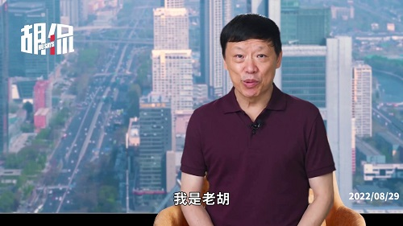

# GoldminerER
## 一、表情及音频双模态情绪识别<PVER-master>
### 环境配置
1. 系统环境配置。于PVER-master/config路径下进行如下操作
  - 新建conda环境, python版本为3.7
  - 使用pip命令分别安装torch2.x、tensorflow1.x、keras2.x、moviepy、cv2、transformers进行基础环境配置，可直接在PVER-master路径下打开命令行执行如下代码
  ```python
  # 由于conda以及pypi官方镜像现在不对python3.6以后的版本提供Dlib安装源，因此需要分两次安装环境
  pip install -r requirements.txt
  ```
  - 安装该路径下的visual sutdio社区版, 勾选python开发以及C++桌面开发（这一步是为了提供Dlib安装基础）
  - 安装该路径下的CMake
  - 使用pip在虚拟环境下安装CMake以及Boost
  ```python
  pip install CMake
  pip install Boost
  ```
  - 安装该路径下的dlib-19.22.99-cp37-cp37m-win_amd64.whl
  ```python
  # 一定要在PVER-master/config路径下打开命令行，否则使用绝对路径进行安装
  pip install dlib-19.22.99-cp37-cp37m-win_amd64.whl
  ```
  - 安装人脸识别模块
  ```python
  pip install face_recognition
  ```
  - 安装音频识别模块
  ```python
  pip install librosa
  ```
### 开始使用
1. 打开PVER-master路径下的main.py, 这是项目的入口.
2. 将以mp4结尾的音视频文件存放在./Repo/video/mp4文件夹下
3. 在main函数中进行如下设定，并在video2data函数中根据注释设置对应的参数，开始进行音视频分离以及视频帧抽取任务
```python
video_tag = True
```
4. 在main函数中进行如下设定, 开始对被抽取的视频帧及音频进行情绪识别任务
```python
video_tag = False
```
### 过程展示
1. 将视频存入指定路径并执行程序
2. 程序将视频的音视频进行分离并对视频进行抽帧，抽帧结果如下</br>

3. 程序输入音视频多模态情绪识别模型，并逐帧框出人脸范围，并对面部情绪进行识别</br>

### 项目结构说明
待补充

# 二、文本主题识别
待补充
# 三、COGMEN
待补充
# 四、待补充
